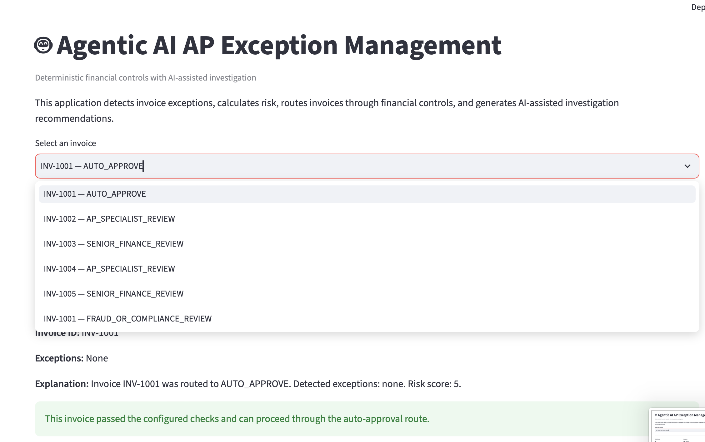
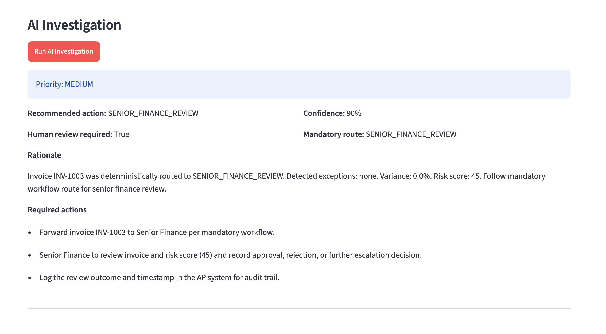
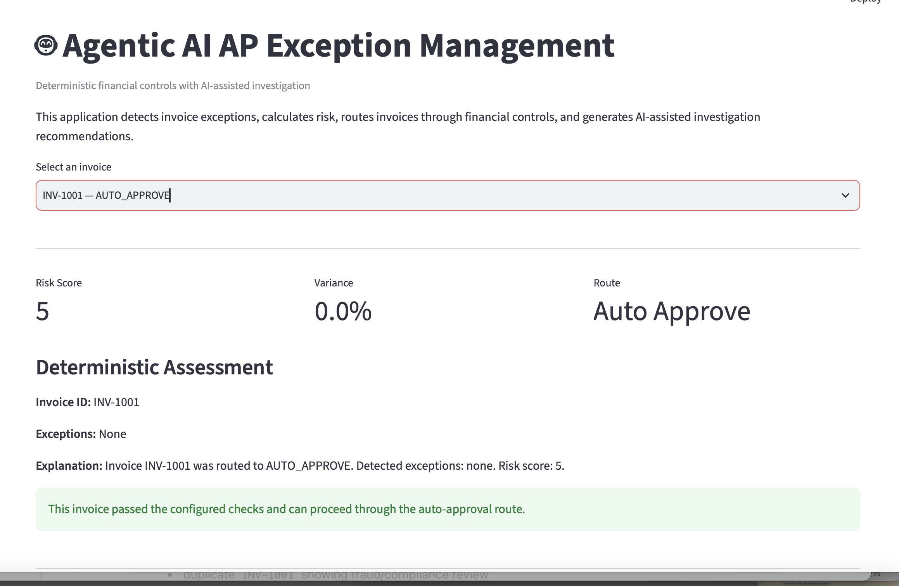

# 🤖 Agentic AI for Accounts Payable Exception Management

> AI-assisted Business Process Automation for Finance Operations


---

# Project Overview

This project demonstrates how **Agentic AI** can improve **Accounts Payable (AP) exception management** while preserving financial governance.

Instead of allowing AI to approve invoices, deterministic business rules remain the source of truth.

The AI agent acts as an investigation assistant that:

- explains routing decisions
- recommends next actions
- prepares audit-ready documentation
- assists AP specialists
- never overrides financial controls

---

# Business Problem

Large organizations process thousands of invoices every day.

Manual invoice reviews often result in

- duplicate payments
- delayed approvals
- missing purchase orders
- invoice amount mismatches
- inconsistent investigations
- fraud risk

Traditional automation can detect issues but cannot assist investigators.

This project combines deterministic process automation with Agentic AI to improve investigation quality while maintaining compliance.

---

# Solution Architecture

```text
                    Invoice
                       │
                       ▼
          ---------------------------
          Rule Validation Engine
          ---------------------------

          ✓ PO Matching
          ✓ Amount Variance
          ✓ Duplicate Detection
          ✓ Vendor Risk
          ✓ Bank Change Detection

                       │
                       ▼

               Risk Score Engine

                       │
                       ▼

             Routing Decision Engine

     ┌────────────────────────────────────┐
     │                                    │
     │ AUTO APPROVE                       │
     │ AP SPECIALIST REVIEW               │
     │ SENIOR FINANCE REVIEW              │
     │ FRAUD / COMPLIANCE REVIEW          │
     │                                    │
     └────────────────────────────────────┘

                       │
                       ▼

             OpenAI Investigation Agent

                       │
                       ▼

          Structured Recommendation

                       │
                       ▼

             Human Decision Maker
```

---

# Workflow

```text
Invoice Received
       │
       ▼
Purchase Order Match
       │
       ▼
Variance Check
       │
       ▼
Duplicate Detection
       │
       ▼
Vendor Risk Assessment
       │
       ▼
Risk Score
       │
       ▼
Business Rule Routing
       │
       ▼
OpenAI Investigation
       │
       ▼
Recommended Actions
       │
       ▼
Human Approval
```

---

# Features

- Duplicate Invoice Detection
- Purchase Order Matching
- Vendor Risk Scoring
- Invoice Variance Detection
- Business Rule Routing
- Structured AI Recommendations
- Fraud Escalation
- Audit Trail
- Human-in-the-loop Approval

---

# Example Output

```text
Invoice: INV-1002

Deterministic Route:
AP_SPECIALIST_REVIEW

AI Recommendation:
AP_SPECIALIST_REVIEW

Priority:
MEDIUM

Human Review Required:
True

Confidence:
0.92

Required Actions

• Validate invoice variance

• Request vendor documentation

• Compare with Purchase Order

• Hold payment until approval

• Update audit trail
```

---

# Project Structure

```text
Agentic-AI/

│

├── app/

│   ├── agents/

│   ├── workflows/

│   ├── tools/

│   ├── models/

│   ├── main.py

│   └── ai_main.py

│

├── data/

│

├── docs/

│

├── tests/

│

├── requirements.txt

│

└── README.md
```

---

# Technologies

- Python
- OpenAI Agents SDK
- Pydantic
- Pandas
- Git
- Business Process Management
- Risk Scoring
- Agentic AI

---

# Business Value

This solution demonstrates how Agentic AI can support finance operations by

- reducing manual investigation effort
- improving invoice processing consistency
- reducing duplicate payment risk
- supporting audit

  ## Application Screenshots

## Dashboard Overview

This dashboard displays invoice routing, deterministic business rules, and invoice selection.



---

## AI Investigation

The AI investigation agent provides structured recommendations while preserving deterministic financial controls.



---

## Fraud / Compliance Review

Duplicate invoices are automatically escalated to Fraud/Compliance review, and the AI generates investigation actions without overriding the mandatory workflow.


